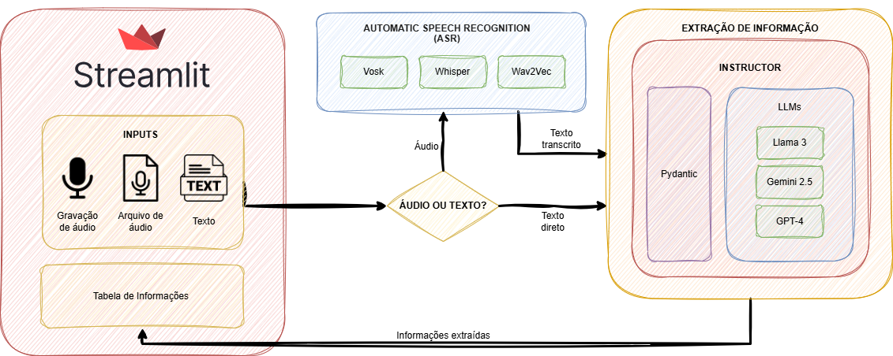

# Extrator de conhecimento para coleta de informações de texto e áudio

Trabalho acadêmico realizado para a disciplina **“Aprendizado Profundo”** do **Programa de Pós-Graduação em Ciência da Computação (PPGCC) da Unesp**.  
Ministrado pelo **Prof. Dr. Denis Henrique Pinheiro Salvadeo**.  
Mais informações sobre o programa podem ser encontradas no site do PPGCC: [PPGCC Unesp](https://www.ibilce.unesp.br/#!/pos-graduacao/programas-de-pos-graduacao/ciencia-da-computacao)

---

## Alunos:

- André Silva  
- Carlos Eduardo Nogueira  
- Elton Júnior

---

# Índice

- [Descrição](#descrição)
- [Arquitetura e Funcionamento da Aplicação](#arquitetura-e-funcionamento-da-aplicação)
- [Instalação e Execução](#instalação)
- [Executando o Benchmark de ASRs](#executando-o-benchmark-de-asrs)

## Descrição
Este projeto tem como objetivo **extrair informações de textos e áudios** e estruturá-las no **formato de tabelas**, facilitando a organização e análise de dados não estruturados. 

## Arquitetura e Funcionamento da Aplicação

O projeto combina **interface web, ASRs, LLMs e extração estruturada de informações** para converter textos e áudios em tabelas.



### Interface
- **Streamlit**: Criação de interfaces interativas em Python, permitindo upload de arquivos de áudio, gravação direta e visualização de resultados em tabelas.

### Provedores de LLM (Model as a Service)
- **OpenAI API**: acesso ao modelo **GPT-4o**  
- **Groq API**: acesso ao modelo **Llama 3** (rápido e de alta performance)  
- **Google Generative AI SDK**: acesso ao modelo **Gemini 2.5 Flash**

### Extração de Informações
- **Instructor**: força os LLMs a responderem estritamente no formato **JSON definido**, garantindo **Structured Output**.

### ASRs (Automatic Speech Recognition)
- **Whisper (OpenAI)**  
  - Biblioteca: `whisper`  
  - Modelo: `base` (configurável via `model_size="base"`)  
  - Idioma: Português  

- **Wav2Vec2 (Meta / Hugging Face)**  
  - Biblioteca: `transformers`  
  - Modelo: `"jonatasgrosman/wav2vec2-large-xlsr-53-portuguese"`  
  - Áudio chunked em trechos de 30s (`chunk_length_s=30`)  
  - Idioma: Português (PT-BR)

- **Vosk (AlpacaCephei)**  
  - Biblioteca: `vosk`  
  - Modelo: `"vosk-model-small-pt-0.3"`  
  - Idioma: Português  
  - Formato de áudio: WAV 16kHz Mono (usando **Pydub** para conversão)

### Modelos de LLM
| Modelo | Provedor | Versão |
|--------|----------|------|
| GPT-4o-mini | OpenAI API | gpt-4o-mini |
| Llama 3.1-8b-instant | Groq API | llama-3.1-8b-instant |
| Gemini 2.5 Flash | Google Generative AI SDK | gemini-2.5-flash |

### Prompt Base
> Você é um extrator de fatos estrito e cético. \
> Sua tarefa é criar pares de Perguntas e Respostas baseadas APENAS no texto fornecido. \
> Regras obrigatórias:
> - NÃO use conhecimento externo ou prévio. Se o texto não diz, você não sabe.
> - Se o texto estiver incompleto ou confuso, extraia apenas o que for explícito.
> - Para cada resposta, DEVE haver a 'citacao_exata' no texto original.
> - Responda em Português do Brasil.

### Validação de Dados
- **Pydantic**: define o **Schema** de saída, garantindo que todos os pares Pergunta-Resposta sigam o formato correto.

- **Schema de Dados**: representa cada par Pergunta-Resposta extraído do texto  
  - **pergunta**: pergunta formulada com base no texto  
  - **resposta**: resposta direta encontrada no texto  
  - **categoria**: categoria curta para o assunto (ex: Data, Técnico, Pessoal)  
  - **citacao_exata**: trecho exato do texto que justifica a resposta


## Instalação

### Pré-requisitos

Antes de instalar o projeto, certifique-se de ter o **FFmpeg** instalado no seu sistema, pois ele é necessário para manipulação de áudios:

- **Windows:** [Baixar FFmpeg](https://ffmpeg.org/download.html)  
- **Linux (Debian/Ubuntu):**  
```bash
sudo apt install ffmpeg
```

1. **Clonar o repositório**  
```bash
git clone https://github.com/carloseduardonogueira/audio-text-info-extraction.git
cd audio-text-info-extraction 
```

2. **Instalar dependências com UV**  

```bash
uv install 
```

3. **Configuração das Chaves de API**

O projeto depende de algumas APIs externas. Para isso, crie um arquivo `.env` na raiz do projeto com as seguintes variáveis:

```env
GROQ_API_KEY= # Chave de acesso à API da Groq
GOOGLE_API_KEY= # Chave de acesso à API do Google
OPENAI_API_KEY= # Chave de acesso à API da OpenAI
```

4. **Executando a Aplicação**

Após instalar as dependências e configurar as chaves no `.env`, você pode rodar a interface web do projeto com **Streamlit**:

```bash
uv run python -m streamlit run app.py
```

## Executando o Benchmark de ASRs

O projeto inclui um script para comparar diferentes modelos de **ASR (Automatic Speech Recognition)**, medindo tempo de transcrição, WER, CER e BERTScore

1. **Certifique-se de que todas as dependências estão instaladas**  
   (veja a seção [Instalação](#instalação) e [Configuração das Chaves de API](#configuração-das-chaves-de-api))  

2. **Executar o benchmark**  
```bash
python benchmark_asr.py --audio_folder CAMINHO_PASTA_AUDIOS --csv_path CAMINHO_CSV [--limit N]
```

#### Parâmetros

- `--audio_folder`: caminho para a pasta contendo os arquivos de áudio 
- `--csv_path`: caminho para o CSV contendo as referências textuais  
- `--limit` (opcional): limita o número de linhas do CSV para teste rápido

### Saída

- O script exibirá no terminal as métricas médias de cada modelo:
  - **WER** (Word Error Rate)  
  - **CER** (Character Error Rate)  
  - **RTF** (Real Time Factor)  
  - **BERTScore**
- Também será gerado um arquivo `metricas_finais.csv` com os resultados detalhados de cada arquivo de áudio e modelo


